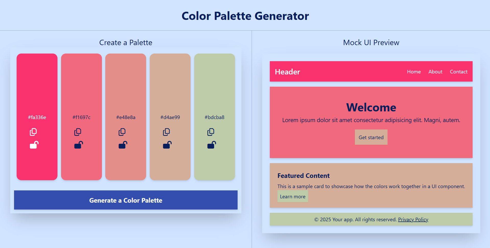

# Color Palette Generator

A modern, interactive tool for creating and previewing color palettes for web design projects. Built with Next.js, TypeScript, and Tailwind CSS.



## Features

- **Generate Harmonious Color Palettes** - Create beautiful color combinations with a single click
- **Interactive Color Picker** - Manually adjust each color in the palette
- **Lock Colors** - Lock specific colors while generating new palettes
- **Copy to Clipboard** - Easily copy color hex codes
- **Real-time UI Preview** - See how your palette looks in a mock website interface
- **Responsive Design** - Works on desktop and mobile devices
- **High-contrast Text** - Automatically adjusts text color for optimal readability

## Live Demo

Check out the live demo: [Color Palette Generator](https://color-picker-helper.vercel.app/)

## Tech Stack

- **Framework**: [Next.js 15](https://nextjs.org/)
- **Language**: [TypeScript](https://www.typescriptlang.org/)
- **Styling**: [Tailwind CSS](https://tailwindcss.com/)
- **Color Management**: [Chroma.js](https://gka.github.io/chroma.js/)
- **Notifications**: [Sonner](https://sonner.emilkowal.ski/)
- **UI Components**: [Shadcn UI](https://ui.shadcn.com/)
- **Deployment**: [Vercel](https://vercel.com/)

## Installation

1. Clone the repository:
   ```bash
   git clone https://github.com/dauntflash/color-picker-helper.git
   cd color-picker-helper
   ```

2. Install dependencies:
   ```bash
   npm install
   ```

3. Run the development server:
   ```bash
   npm run dev
   ```

4. Open [http://localhost:3000](http://localhost:3000) in your browser to see the application.


## How It Works

1. **Palette Generation**: Uses Chroma.js to create harmonious color scales between two random colors.
2. **Color Manipulation**: Each color in the palette can be individually selected and modified.
3. **Lock Mechanism**: Colors can be locked to prevent them from changing during regeneration.
4. **Contrast Calculation**: Automatically calculates text color based on background luminance for optimal readability.
5. **UI Preview**: Shows how the palette would look in a real-world website with various UI elements.

## Usage

- Click "Generate a Color Palette" to create a new color scheme
- Click on any color to open the color picker and adjust it
- Use the lock icon to preserve colors you like while generating new palettes
- Click the copy icon to copy the hex code to your clipboard
- View the mock UI to see how your colors work together in a real design

## License

This project is licensed under the MIT License - see the [LICENSE](LICENSE) file for details.

## Author

- [@dauntflash](https://github.com/dauntflash)


---

Feel free to star ⭐ this repository if you find it useful!
